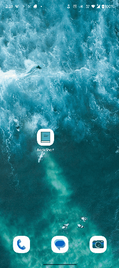

# BookShelf App 📚

#### An Android application for browsing, reviewing, and saving favorite books developed in JAVA. Built with MVVM architecture, Room Database, LiveData and a fake JSON file.

## Features ✨
- Browse books from local JSON data
- View detailed book information
- Mark books as favorites
- Offline persistence with Room Database
- MVVM architecture

## Prerequisites 🛠️
- Android Studio Flamingo or later
- Android SDK 31+
- Java 17+

## Testing the Project 💻

- Just clone the repository and import in your android studio.

- You can also install on your phone and run it using the apk file provided in "APKs" directory.

## Screenshots 📸

  
  
     

